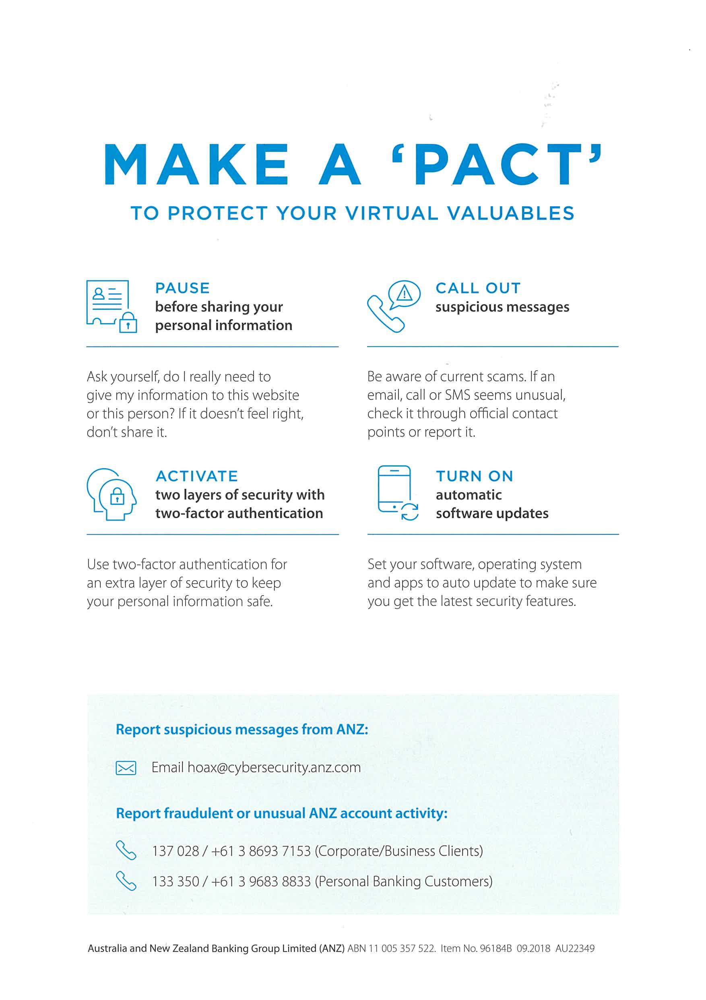

  

<h1 align="center">Forage Virtual Experience Write-up - ANZ</h1>
 

<b>Technologies Used: </b>
  
- Wireshark
- Hex Editor (Hex Fiend for macOS, you can use HxD if you are using Windows)
- Visual Studio Code
- Python
 
Packet Capture Analysis:
 
Analyzing a packet capture from a network provided to me. I filtered it to HTTP traffic to look at the contents of the HTTP packet.
 
Note: You can also download the pcap file if you want to follow along.
 

 
Sub-task 1: 

- anz-logo.jpg and bank-card.jpg are two images that show up in the users network traffic.
- Extract these images from the pcap file and attach them to your report.

To look at the images the user accessed named anz-logo.jpg and bank-card.jpg, I right-clicked on them and followed the TCP stream. The raw data string is too long, so I created a simple script that will automate the process of getting the raw data between the first hex (FFD8) and the last hex (FFD9), my script then will output it in a text file. This is the script I used:
 

 
You can also download this script and the file name is script.py.

 
 

This is how the program works:
 

 
 

And voila here is the extracted hex data:
 

 

I copied and pasted it to my hex editor and saved it as JPG file format to view the data and this is what I found:
anz_logo.jpg
 
 

 
bank-card.jpg
 

 
Sub-task 2: 

- The network traffic for the images "ANZ1.jpg" and "ANZ2.jpg" is more than it appears.
- Extract the images, include them and mention what is different about them in your report.

The same method applies when extracting images, after performing the previous steps, these are the images I found:
 
 
ANZ1.jpg
 

 
 
ANZ2.jpg
 

 
 
I saw this message at the end of the hex data of these images:

For anz1.jpg:
 

 
 
For anz2.jpg:
 

Sub-task 3: 

- The user downloaded a suspicious document called "how-to-commit-crimes.docx"
- Find the contents of this file and include it in your report.

I checked this specific traffic and found this:
 

 
Sub-task 4: 

- The user accessed 3 pdf documents: ANZ_Document.pdf, ANZ_Document2.pdf, evil.pdf
- Extract and view these documents. Include images of them in your report.
  

This time I did it differently, I utilized the search function on wireshark and put the hex data on raw. I searched for “25504446” since it is a pdf file signature, I copied and pasted from 25504446 until the end of the hex data. I did it to all these pdf files and here are the results:
 
 
anz_doc1.pdf
 

 
 
anz_doc2.pdf
 

 
 
evil.pdf
 

Sub-task 5: 

- The user also accessed a file called "hiddenmessage2.txt"
- What is the contents of this file? Include it in your report

For this one, I can’t find the txt signature file, so I tried typing ffd8 and it worked, I believe this is a jpg file hidden in a txt file, I found this image:
 
 
hiddenmessage.jpg

 
Sub-task 6: 

- The user accessed an image called "atm-image.jpg"
- Identify what is different about this traffic and include everything in your report.

I noticed there are 2 FFD8 in the hex value, leaving me puzzled, so I tried breaking it into 2 and yes I found 2 photos. Here are the photos I gathered:
 
 
atm.jpg
 

 
 
atm2.jpg
 

Sub-task 7: 

- The network traffic shows that the user accessed the image "broken.png"
- Extract and include the image in your report.

I’ll be honest but this is the section I kind of struggled with, so I pasted the ASCII data to chatgpt and was informed that this is a base64 encoding. I looked online for a base64 conversion tool and the result I have is this image:
 
 

Sub-task 8: 

- The user accessed one more document called securepdf.pdf
- Access this document include an image of the pdf in your report. Detail the steps to access it

<b> These are the steps I took for this task:</b>
 

1. I tried looking at the packet and it is not a pdf file since it is not finding the pdf signature, so again I posted this hex value to chatgpt and I was told that this was a zip file.
2. I looked for online tool that can convert this hex to zip file.
3.  After I did that, the zip file was reconstructed, but I was asked for a password.
4.  I looked at the ASCII data of the packet and looked at the very bottom and found this:  

 
 
Lastly, I went back to the file and put “secure” as the password and yes it gave me a pdf file called rawpdf.pdf. I opened it and I was presented with 2 pages of pdf. Here is the image:
 

 
 
 
 

 
  I hope you found value in this write-up. Thank you for dedicating your time to reading it and joining me on my cybersecurity journey!

